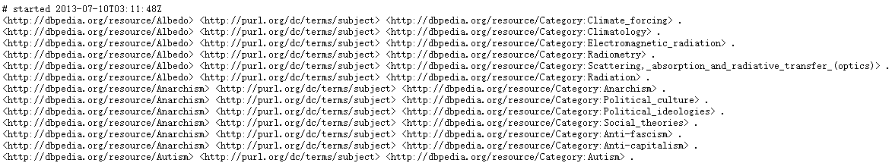
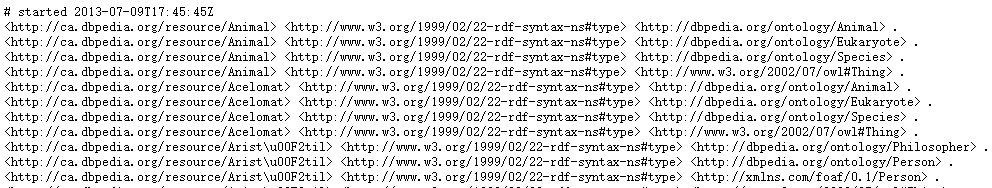
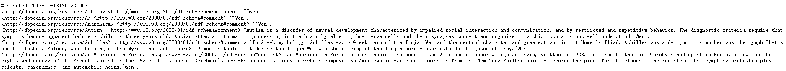
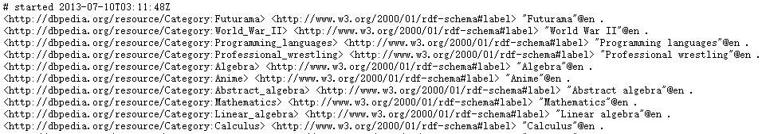

# Dbpedia Data Processing
 This project shows that how to process the dbpedia data.
 
# Download the Dataset
 Download the following 4 dataset files and unzip them to the 'dataset' folder.

>Categories

Part of data: 

<a href="http://downloads.dbpedia.org/3.9/en/article_categories_en.nt.bz2">Click here</a> to download

>Types

Part of data: 

<a href="http://downloads.dbpedia.org/3.9/en/instance_types_en.nt.bz2">Click here </a>to download

>Description

Part of data: 

<a href="http://downloads.dbpedia.org/3.9/en/short_abstracts_en.nt.bz2">Click here </a>to download

>Labels

Part of data: 

<a href="http://downloads.dbpedia.org/3.9/en/labels_en.nt.bz2">Click here </a>to download

# Requirments
 python=3.6.9 or higher

# Steps
##Step 1
Get valid entities: in this project, a valid entity must have at least a type and a category, which means that it should be in both 'categories file' and 'types file'(you have download before).
##Step 2

##Step 3

##Step 4
